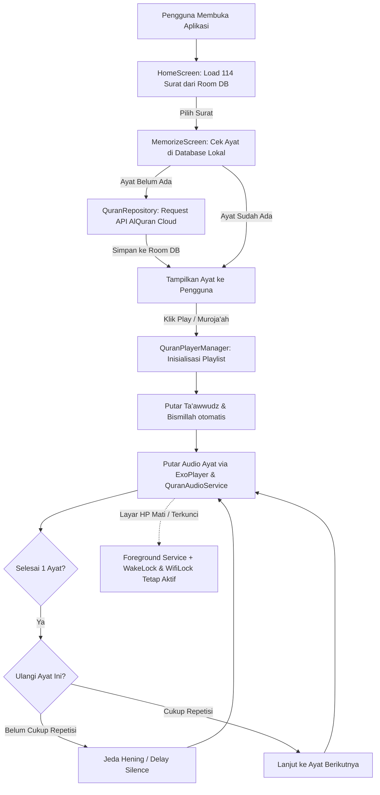

# 📖 DOKUMENTASI ARSITEKTUR, API, & ALUR SISTEM APLIKASI HAFAL QUR'AN

Dokumen ini menjelaskan secara menyeluruh struktur proyek aplikasi **Hafal Qur'an**, lokasi komponen **User Interface (UI)**, sumber **API Mushaf & Audio**, serta **alur proses kerja internal** (Arsitektur Offline-First, Engine Audio Background, Mode Baca Mushaf, dan Manajemen Hafalan).

---

## 📑 DAFTAR ISI
1. [Ringkasan Teknologi (Tech Stack)](#1-ringkasan-teknologi-tech-stack)
2. [Di Mana UI Berada (Presentation Layer)](#2-di-mana-ui-berada-presentation-layer)
3. [Di Mana API Mushaf & Audio Berada (Network & Data Layer)](#3-di-mana-api-mushaf--audio-berada-network--data-layer)
4. [Penjelasan Alur & Proses Aplikasi](#4-penjelasan-alur--proses-aplikasi)
   - [A. Alur Sinkronisasi & Database Offline (Offline-First)](#a-alur-sinkronisasi--database-offline-offline-first)
   - [B. Alur Engine Audio & Pemutaran Background (Layar Mati)](#b-alur-engine-audio--pemutaran-background-layar-mati)
   - [C. Alur Pengulangan (Looping) & Jeda Hening (Spaced Repetition)](#c-alur-pengulangan-looping--jeda-hening-spaced-repetition)
   - [D. Alur Mode Baca Mushaf & Kustomisasi Tampilan](#d-alur-mode-baca-mushaf--kustomisasi-tampilan)
   - [E. Alur Target Hafalan & Tracking Progress](#e-alur-target-hafalan--tracking-progress)
5. [Struktur Folder Proyek](#5-struktur-folder-proyek)

---

## 1. Ringkasan Teknologi (Tech Stack)

| Komponen | Teknologi | Keterangan |
| :--- | :--- | :--- |
| **Language** | Kotlin 1.9.23 / JDK 17 | Bahasa pemrograman modern & type-safe |
| **UI Framework** | Jetpack Compose & Material 3 | Declarative UI dengan tema Islamic Luxury Dark |
| **Audio Engine** | AndroidX Media3 (ExoPlayer + MediaSessionService) | Audio playback standar industri dengan MediaSession |
| **Local Database** | Room Database + KSP | Penyimpanan offline-first ayat, status hafalan, & target |
| **Networking** | Retrofit 2 + OkHttp 3 + Gson | HTTP Client untuk sinkronisasi teks & URL audio |
| **Concurrency** | Kotlin Coroutines & Flow | Reactive reactive programming & background thread management |
| **Persistence** | SharedPreferences & Room | Pengaturan preferensi tampilan & database lokal |

---

## 2. Di Mana UI Berada (Presentation Layer)

Seluruh antarmuka pengguna (UI) dibangun menggunakan **Jetpack Compose** dan terletak di direktori:
📁 `app/src/main/java/com/hafalquran/app/ui/` dan `MainActivity.kt`

```
app/src/main/java/com/hafalquran/app/
├── MainActivity.kt                      # Root Activity, Bottom Navigation & Mini Player Overlay
└── ui/
    ├── theme/
    │   ├── Color.kt                     # Definisi warna (EmeraldDark, GoldAccent, QuranBgDark, dll)
    │   ├── Theme.kt                     # Theme wrapper (HafalQuranTheme)
    │   └── Type.kt                      # Konfigurasi tipografi & font
    ├── components/
    │   └── QuranComponents.kt          # Komponen UI Reusable (SurahCard, AyahItem, Dialog Info, Mini Player)
    └── screens/
        ├── HomeScreen.kt                # Halaman Utama (Daftar 114 Surat & Quick Muroja'ah)
        ├── MemorizeScreen.kt           # Halaman Detail Surat, Mode Mushaf, Looping & Player Controls
        ├── MyTargetScreen.kt           # Halaman Manajemen Target Hafalan
        ├── ProgressScreen.kt           # Halaman Statistik & Pencapaian Hafalan (Mutqin / Juz 30)
        ├── AboutScreen.kt               # Halaman Visi, Sumber Rujukan, & Panduan Baterai
        └── DonationScreen.kt            # Halaman Infaq / Dukungan Wakaf Digital
```

### Rincian Fungsi Tiap Layar UI:

1. **[MainActivity.kt](file:///c:/Users/lenovo/Documents/PRO/hafal-quran/app/src/main/java/com/hafalquran/app/MainActivity.kt)**
   - Mengelola navigasi tab bawah (*Bottom Navigation Bar*): `QURAN`, `MY_TARGET`, `PROGRESS`, `DONATION`, `ABOUT`.
   - Menampilkan **Floating Mini Player (`PlayerMiniBottomBar`)** di bagian bawah layar saat audio sedang aktif diputar.

2. **[HomeScreen.kt](file:///c:/Users/lenovo/Documents/PRO/hafal-quran/app/src/main/java/com/hafalquran/app/ui/screens/HomeScreen.kt)**
   - Menampilkan daftar 114 Surat lengkap dengan nama Arab, nama Latin, terjemahan, dan jumlah ayat.
   - Fitur pencarian instan (berdasarkan nama surat atau nomor surat).
   - Tombol **"Mode Muroja'ah Cepat Juz 30"** untuk langsung memutar surat juz 30 di background.
   - Link bantuan **"Tips audio lancar saat layar HP mati"**.

3. **[MemorizeScreen.kt](file:///c:/Users/lenovo/Documents/PRO/hafal-quran/app/src/main/java/com/hafalquran/app/ui/screens/MemorizeScreen.kt)**
   - **Mode Baca Mushaf:** Tombol pintas untuk menyembunyikan teks latin & terjemahan, menyisakan teks ayat Arab berukuran besar untuk kenyamanan tilawah.
   - **Dialog "Atur Tampilan":** Switch On/Off mandiri untuk (1) Latin, (2) Terjemahan Kemenag, (3) Tombol Audio per ayat, (4) Panel pengulangan, serta **Slider Ukuran Font Arab (22sp–42sp)** dengan live preview.
   - **Panel Pengaturan Hafalan:** Pengaturan pengulangan ayat (1x, 3x, 5x, 10x, Loop ∞), jeda hening antar ayat (0s s/d 5s), dan tombol sinkronisasi ayat.
   - **Daftar Ayat (`LazyColumn`):** Menampilkan ayat-ayat menggunakan komponen `AyahItem`.

4. **[MyTargetScreen.kt](file:///c:/Users/lenovo/Documents/PRO/hafal-quran/app/src/main/java/com/hafalquran/app/ui/screens/MyTargetScreen.kt)**
   - Membuat rencana target hafalan baru (memilih surat dan rentang ayat target).
   - Menandai checklist ayat yang sudah dihafal dan mencatat evaluasi kelancaran.

5. **[ProgressScreen.kt](file:///c:/Users/lenovo/Documents/PRO/hafal-quran/app/src/main/java/com/hafalquran/app/ui/screens/ProgressScreen.kt)**
   - Dashboard statistik interaktif: Total Ayat Mutqin (Lancar), Learning (Proses), dan Need Review (Perlu Ulang).
   - Progress bar khusus kelulusan Juz 30 (564 ayat) dan seluruh Al-Qur'an (6236 ayat).

6. **[AboutScreen.kt](file:///c:/Users/lenovo/Documents/PRO/hafal-quran/app/src/main/java/com/hafalquran/app/ui/screens/AboutScreen.kt)**
   - Informasi rujukan data otentik (Kemenag RI & Quran.com).
   - Panduan teknis pemutaran audio latar belakang (Android Doze Mode) + tombol pintasan ke menu pengaturan baterai HP.

7. **[QuranComponents.kt](file:///c:/Users/lenovo/Documents/PRO/hafal-quran/app/src/main/java/com/hafalquran/app/ui/components/QuranComponents.kt)**
   - `SurahCard`: Kartu surat di halaman Home.
   - `AyahItem`: Item ayat di halaman detail (mendukung kustomisasi visibilitas elemen & font dinamis).
   - `PlayerMiniBottomBar`: Bar kontrol pemutar audio mengambang (Play/Pause, Prev, Next, indikator putaran & jeda).
   - `BackgroundAudioInfoDialog`: Pop-up dialog edukasi pengaturan baterai dan izin aplikasi.

---

## 3. Di Mana API Mushaf & Audio Berada (Network & Data Layer)

Seluruh konfigurasi API dan pengambilan data berada di direktori:
📁 `app/src/main/java/com/hafalquran/app/data/`

```
app/src/main/java/com/hafalquran/app/data/
├── remote/
│   └── QuranApiService.kt              # Retrofit Interface & DTO Response
├── local/
│   ├── QuranDatabase.kt                # Room Database Class
│   ├── QuranEntities.kt                # Entitas Tabel (SurahEntity, AyahEntity, TargetTaskEntity, MurojaahHistoryEntity)
│   └── QuranDao.kt                     # Data Access Object (Query SQL Room)
├── model/
│   └── Models.kt                       # Domain Data Models (Surah, Ayah, MemorizeConfig, MemorizeLevel)
└── repository/
    └── QuranRepository.kt              # Repository Penggabung Data API & Lokal
```

### A. Endpoint API Mushaf & Audio
Didefinisikan di **[QuranApiService.kt](file:///c:/Users/lenovo/Documents/PRO/hafal-quran/app/src/main/java/com/hafalquran/app/data/remote/QuranApiService.kt)**:

* **Base URL:** `https://api.alquran.cloud/v1/`

#### 1. Endpoint Daftar Surat
```http
GET https://api.alquran.cloud/v1/surah
```
* **Fungsi:** Mengambil metadata 114 Surat (Nomor, Nama Arab, Nama Inggris, Jumlah Ayat, Jenis Makkiyah/Madaniyah).

#### 2. Endpoint Teks Mushaf, Terjemahan, & Audio (3-in-1 Multi-Edition)
```http
GET https://api.alquran.cloud/v1/surah/{number}/editions/quran-uthmani,id.indonesian,ar.alafasy
```
* **Fungsi:** Dalam 1 kali request HTTP, endpoint ini mengembalikan 3 data sekaligus:
  1. `quran-uthmani`: Teks Arab Al-Qur'an Standar Rasm Uthmani resmi.
  2. `id.indonesian`: Terjemahan resmi Bahasa Indonesia (Kementerian Agama RI).
  3. `ar.alafasy`: URL Audio Murottal per ayat oleh Qari Syaikh Mishary Rashid Alafasy.

### B. Sumber CDN Audio Murottal (Per Ayat)
- **Format URL Audio CDN:**  
  `https://cdn.islamic.network/quran/audio/128/ar.alafasy/{numberInQuran}.mp3`  
  *(Di mana `{numberInQuran}` adalah urutan ayat global 1 s/d 6236)*.
- **Audio Adab Tilawah (Pembuka):**
  - **Isti'adzah / Ta'awwudz:** `https://everyayah.com/data/Alafasy_128kbps/001000.mp3`
  - **Basmalah:** `https://everyayah.com/data/Alafasy_128kbps/001001.mp3`

---

## 4. Penjelasan Alur & Proses Aplikasi



### A. Alur Sinkronisasi & Database Offline (Offline-First)
1. Saat pengguna membuka surat tertentu di `MemorizeScreen`, aplikasi memeriksa database Room (`QuranDao.getAyahsRange()`).
2. Jika data ayat belum tersimpan di lokal, `QuranRepository.syncSurahAyahs()` memanggil endpoint Retrofit multi-edition.
3. Data teks Arab, terjemahan Kemenag, nomor ayat, dan URL audio dipetakan ke dalam `AyahEntity` lalu disimpan secara permanen ke database lokal SQLite (Room).
4. Setelah tersimpan, pembacaan dan pemutaran ayat dapat dilakukan **100% offline tanpa kuota internet**.

### B. Alur Engine Audio & Pemutaran Background (Layar Mati)
Komponen terkait:
- **[QuranAudioService.kt](file:///c:/Users/lenovo/Documents/PRO/hafal-quran/app/src/main/java/com/hafalquran/app/service/QuranAudioService.kt)** (Android Media3 `MediaSessionService`)
- **[QuranPlayerManager.kt](file:///c:/Users/lenovo/Documents/PRO/hafal-quran/app/src/main/java/com/hafalquran/app/player/QuranPlayerManager.kt)** (State Controller & Coroutine Engine)

1. **Inisialisasi:** `QuranPlayerManager` membuat koneksi `MediaController` ke `QuranAudioService`.
2. **Foreground Media Notification:** `QuranAudioService` otomatis menampilkan notifikasi pemutar media di status bar dan Lockscreen Android dengan tombol Play, Pause, Next, Prev.
3. **Pencegahan Android Doze Mode:**
   - Selama pemutaran aktif, aplikasi memegang `PowerManager.PARTIAL_WAKE_LOCK` dan `WifiManager.WifiLock`.
   - Hal ini memastikan CPU dan modul Wi-Fi tidak ditidurkan oleh sistem Android saat layar HP mati lebih dari 10–15 menit, sehingga coroutine jeda antar ayat tetap berjalan lancar.

### C. Alur Pengulangan (Looping) & Jeda Hening (Spaced Repetition)
1. Pengguna dapat memilih jumlah pengulangan tiap ayat (misal: 3x) dan jeda hening (misal: 2 detik).
2. **Preamble Adab Tilawah:** Saat pertama kali diputar, aplikasi secara cerdas melantunkan Ta'awwudz lalu Basmalah sebelum memulai ayat ke-1 (kecuali Surat At-Taubah).
3. **Looping Ayat:**
   - Ayat 1 diputar -> Selesai -> Status masuk ke jeda hening (`delay(pauseMs)`) agar pengguna bisa menirukan -> Putar Ayat 1 putaran ke-2 -> dst.
4. **Looping Playlist (Set):** Setelah ayat terakhir selesai, jika opsi loop set aktif, pemutar otomatis mengulang kembali dari ayat awal (*Continuous Muroja'ah Loop*).

### D. Alur Mode Baca Mushaf & Kustomisasi Tampilan
1. Pengguna dapat menekan tombol **"📖 Mode Baca Mushaf"**:
   - Sistem otomatis men-toggle `showLatin = false`, `showTranslation = false`, `showAudioButton = false`, dan menaikkan font Arab ke ukuran minimal 32sp.
2. Pengguna juga dapat menyesuaikan tampilan secara granular melalui dialog **"⚙️ Atur Tampilan"** (ukuran font dari 22sp hingga 42sp).
3. Preferensi disimpan ke `SharedPreferences` (`hafal_quran_display_prefs`) sehingga saat aplikasi dibuka kembali, pengaturan tampilan favorit pengguna langsung diterapkan.

### E. Alur Target Hafalan & Tracking Progress
1. Pengguna memilih target surat di `MyTargetScreen`.
2. Setiap ayat memiliki level hafalan:
   - 🔴 **Belum Hafal (NOT_STARTED)**
   - 🟡 **Sedang Menghafal (LEARNING)**
   - 🔵 **Perlu Ulang / Muroja'ah (NEED_REVIEW)**
   - 🟢 **Lancar / Mutqin (MUTQIN)**
3. Progress secara otomatis diagregasi oleh `QuranRepository.statsFlow` menggunakan Reactive Flow Room Database untuk memperbarui grafik di `ProgressScreen`.

---

## 5. Struktur Folder Proyek

```
c:\Users\lenovo\Documents\PRO\hafal-quran\
├── app/
│   ├── build.gradle.kts                   # Konfigurasi Gradle, Dependencies, & Versioning
│   ├── src/main/
│   │   ├── AndroidManifest.xml           # Izin Foreground Service, WakeLock, Audio Service
│   │   ├── java/com/hafalquran/app/
│   │   │   ├── HafalQuranApp.kt          # Application class (Room Database Singleton)
│   │   │   ├── MainActivity.kt           # Entry Point & Navigation
│   │   │   ├── data/
│   │   │   │   ├── local/                # Room DB (QuranDatabase, QuranEntities, QuranDao)
│   │   │   │   ├── model/                # Domain Data Models (Surah, Ayah, MemorizeConfig)
│   │   │   │   ├── remote/               # Retrofit API Client (QuranApiService)
│   │   │   │   └── repository/           # Single Source of Truth (QuranRepository)
│   │   │   ├── player/                   # QuranPlayerManager & PlayerUiState
│   │   │   ├── service/                  # QuranAudioService (MediaSessionService)
│   │   │   └── ui/
│   │   │       ├── components/           # Reusable UI Widgets & Dialogs
│   │   │       ├── screens/              # 6 Layar Utama Aplikasi
│   │   │       └── theme/                # Tema, Warna Emerald/Gold, & Tipografi
│   │   └── res/                          # Asset Drawable, XML Icon, Layout Resource
├── Hafal-Quran-v1.3.apk                   # File APK Siap Install
└── DOKUMENTASI_ARSITEKTUR_DAN_API.md      # File Dokumentasi ini
```

---
*Dokumentasi ini dibuat untuk mempermudah pemahaman arsitektur kode, pemeliharaan, serta pengembangan fitur lanjutan aplikasi Hafal Qur'an.*
